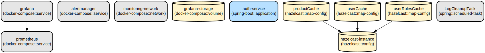

# Secure Authentication and Authorization Service with Monitoring

A robust Spring Boot-based authentication service that provides secure user management, JWT-based authentication, and comprehensive monitoring capabilities through Prometheus and Grafana integration.

This service is designed to provide enterprise-grade security features while maintaining high performance through caching and monitoring. It offers JWT-based authentication, role-based access control (RBAC), and integrates with MySQL for persistent storage. The service includes comprehensive monitoring through Prometheus and Grafana, with alerting capabilities via AlertManager.

The service provides:
- Secure user authentication with JWT tokens
- Role-based access control with granular permissions
- Distributed caching using Hazelcast
- Comprehensive monitoring and alerting
- Internationalization support
- Automated log management
- OpenAPI documentation

## Repository Structure
```
.
├── auth-service/               # Core authentication service
│   ├── src/                   # Source code directory
│   │   ├── main/             
│   │   │   ├── java/         # Java source files
│   │   │   └── resources/    # Application properties and configurations
│   │   └── test/             # Test files
│   └── build.gradle          # Gradle build configuration
├── config-server/             # Configuration server for centralized config management
├── monitoring/                # Monitoring stack configuration
│   ├── alertmanager/         # AlertManager configuration for alerts
│   ├── grafana/              # Grafana dashboards and datasources
│   └── prometheus/           # Prometheus configuration and alert rules
└── scripts/                   # Utility scripts for maintenance
```

## Usage Instructions
### Prerequisites
- JDK 17 or later
- MySQL 8.0 or later
- Docker and Docker Compose (for monitoring stack)
- Gradle 7.x or later

### Installation

1. Clone the repository:
```bash
git clone <repository-url>
cd auth-service
```

2. Configure MySQL:
```bash
# Create database
mysql -u root -p
CREATE DATABASE crmDBtest;
```

3. Configure application properties:
```bash
# Edit src/main/resources/application.properties
spring.datasource.url=jdbc:mysql://localhost:3306/crmDBtest
spring.datasource.username=<your-username>
spring.datasource.password=<your-password>
```

4. Build the service:
  ```bash
    ./gradlew clean build
  ```

5. Start the monitoring stack:
```bash
   # to stop
      docker-compose -f docker-compose-monitoring.yml down
   # Start Prometheus, Alertmanager, and Grafana:
      docker-compose -f docker-compose-monitoring.yml up -d
   ```

### Quick Start
1. Start the service:
  ```bash
  ./gradlew bootRun
  ```

2. Create a new user:
  ```bash
  curl -X POST http://localhost:1007/api/auth/signup \
    -H "Content-Type: application/json" \
    -d '{"username":"user1","password":"password123","name":"Test User","email":"user@example.com"}'
  ```

3. Login to get JWT token:
  ```bash
  curl -X POST http://localhost:1007/api/auth/login \
    -H "Content-Type: application/json" \
    -d '{"usernameOrEmail":"user1","password":"password123"}'
  ```

### More Detailed Examples

1. Protected API access using JWT:
```bash
curl -X GET http://localhost:1007/api/products \
  -H "Authorization: Bearer <your-jwt-token>"
```

2. Cache management:
```bash
# Clear specific cache
curl -X DELETE http://localhost:1007/api/cache/products \
  -H "Authorization: Bearer <your-jwt-token>"
```

### Pagination Support

The service supports pagination for list endpoints to efficiently handle large datasets.

1. Basic pagination:
```bash
# Get paginated products (page 0, 10 items per page)
curl -X GET "http://localhost:1007/api/products?page=0&size=10" \
  -H "Authorization: Bearer <your-jwt-token>"
```

2. Pagination with sorting:
```bash
# Get paginated products sorted by name ascending
curl -X GET "http://localhost:1007/api/products?page=0&size=10&sort=name,asc" \
  -H "Authorization: Bearer <your-jwt-token>"
```

The paginated response includes:
- Content: Array of items for current page
- Pagination metadata:
  - totalElements: Total number of items
  - totalPages: Total number of pages
  - currentPage: Current page number
  - pageSize: Items per page
  - hasNext: Boolean indicating if next page exists
  - hasPrevious: Boolean indicating if previous page exists
  - sort: Current sort parameters


### Troubleshooting

1. JWT Token Issues
- Error: "Invalid JWT token"
  - Check token expiration (default 7 days)
  - Verify token signature with configured secret
  - Debug by enabling logging: `logging.level.org.springframework.security=DEBUG`

2. Database Connection Issues
- Error: "Unable to connect to MySQL"
  - Verify MySQL is running: `systemctl status mysql`
  - Check connection properties in application.properties
  - Ensure database exists and user has proper permissions

3. Monitoring Stack Issues
- Prometheus not scraping metrics:
  - Check target status in Prometheus UI (http://localhost:9090/targets)
  - Verify auth-service metrics endpoint: http://localhost:1007/actuator/prometheus

## Data Flow
The service implements a layered architecture for secure authentication and authorization.

```ascii
Client -> [JWT Filter] -> [Security Layer] -> [Controller Layer]
                                                    |
[Cache] <- [Service Layer] <- [Repository Layer] <- |
   |              |
   v              v
[Hazelcast]    [MySQL]
```

Component interactions:
- JWT Filter validates tokens and sets SecurityContext
- Controllers handle HTTP requests and delegate to services
- Services implement business logic with caching
- Repositories handle data persistence
- Hazelcast provides distributed caching
- MySQL stores user and authentication data

## Infrastructure



### Monitoring Stack
- Prometheus
  - Type: Container
  - Port: 9090
  - Purpose: Metrics collection and storage

- Alertmanager
  - Type: Container
  - Port: 9093
  - Purpose: Alert handling and notification

- Grafana
  - Type: Container
  - Port: 3000
  - Purpose: Metrics visualization and dashboards

### Cache Configuration
- Hazelcast
  - Instance Name: hazelcast-instance
  - Port: 5701
  - Caches:
    - productCache: 5 minutes TTL
    - userCache: 5 minutes TTL
    - userRolesCache: 5 minutes TTL

## Deployment

1. Build the application:
```bash
./gradlew clean build
```

2. Deploy monitoring stack:
```bash
docker-compose -f docker-compose-monitoring.yml up -d
```

3. Configure environment:
```bash
export SPRING_PROFILES_ACTIVE=production
export JWT_SECRET=your-secret-key
```

4. Start the service:
```bash
java -jar build/libs/auth-service-0.0.1-SNAPSHOT.jar
```