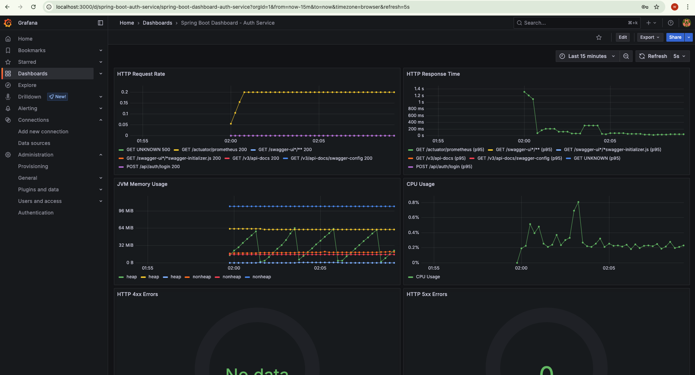

# Spring Boot Monitoring with Prometheus and Grafana

This explains how to monitor your Spring Boot application using Prometheus and Grafana.

## Setup Overview

The monitoring setup consists of:

1. **Spring Boot Actuator**: Exposes application metrics
2. **Prometheus**: Collects and stores metrics
3. **Grafana**: Visualizes metrics in dashboards

## Prerequisites

- Docker and Docker Compose installed
- Spring Boot application with Actuator and Prometheus dependencies

## Configuration Files

The monitoring setup includes:

- `docker-compose-monitoring.yml`: Defines Prometheus and Grafana services
- `prometheus/prometheus.yml`: Configures Prometheus to scrape metrics from your Spring Boot application
- `grafana/provisioning/`: Contains Grafana configuration for datasources and dashboards

## How to Start Monitoring

1. **Start your Spring Boot application**

   ```bash
   # For auth-service
   cd auth-service
   ./gradlew bootRun --args='--spring.profiles.active=monitoring'
   ```
    Access application Actuator endpoints:
   - http://localhost:1007/actuator
   - http://localhost:1007/actuator/health
   - http://localhost:1007/actuator/info
   - http://localhost:1007/actuator/metrics
   - http://localhost:1007/actuator/metrics/system.cpu.usage
   - http://localhost:1007/actuator/prometheus

   ```bash
     # /actuator/health: Shows application health information
     # /actuator/info: Displays application information
     # /actuator/metrics: Shows metrics information
     # /actuator/env: Exposes environment properties
     # /actuator/loggers: Shows and modifies logger configurations
     # /actuator/prometheus: Exposes metrics in Prometheus format     
   ```

2. **Start Prometheus and Grafana**

   ```bash
   # to stop
      docker-compose -f docker-compose-monitoring.yml down
   # Start Prometheus, Alertmanager, and Grafana:
      docker-compose -f docker-compose-monitoring.yml up -d
   ```

3. **Access Grafana  & Prometheus**
 
  ```bash
    Open your browser and navigate to:
     Grafana: http://localhost:3000 
     Default credentials:
        - Username: admin
        - Password: admin
    Prometheus : http://localhost:9090
    Alertmanager: http://localhost:9093
 
   ```
4. **View Dashboards**

   The Spring Boot Dashboard should be automatically provisioned and available in Grafana.

 
   

## Available Metrics

The setup includes monitoring for:

- HTTP request rate and response times
- Error rates (4xx and 5xx status codes)
- JVM memory usage
- CPU usage
- Custom application metrics

## Monitoring Features

1. **Metrics Collection**: Spring Boot Actuator + Prometheus
2. **Visualization**: Grafana dashboards for system and application metrics
3. **Alerting**: Automatic alerts for 500 errors and high error rates
4. **Notifications**: Email and Microsoft Teams integration

## Alert System

The monitoring system includes alerts for:
- HTTP 500 errors
- High error rates
- API-specific errors 
<!-- For detailed alert setup instructions, see [README-ALERTS.md](README-ALERTS.md) -->

## Adding Custom Metrics

You can add custom metrics to your application using the `MetricsService`:

```java
@RestController
public class ExampleController {

    private final MetricsService metricsService;

    @Autowired
    public ExampleController(MetricsService metricsService) {
        this.metricsService = metricsService;
    }

    @GetMapping("/example")
    public ResponseEntity<String> example() {
        // Increment a counter
        metricsService.incrementCounter("example.request.count", "endpoint", "example");

        // Time an operation
        return metricsService.recordTimer("example.request.time", 
            () -> ResponseEntity.ok("Example response"), 
            "endpoint", "example");
    }
}
```

## Troubleshooting

1. **Cannot connect to Spring Boot application**

   Make sure your application is running and the Actuator endpoints are exposed. Check the application logs for any errors.

2. **Prometheus cannot scrape metrics**

   Verify that the target URL in `prometheus.yml` matches your application's host and port. For Docker Desktop on Mac/Windows, use `host.docker.internal` instead of `localhost`.

3. **No data in Grafana**

   Check that Prometheus is successfully scraping metrics from your application. Navigate to `http://localhost:9090/targets` to see the status of your targets.

## Additional Resources

- [Spring Boot Actuator Documentation](https://docs.spring.io/spring-boot/docs/current/reference/html/actuator.html)
- [Prometheus Documentation](https://prometheus.io/docs/introduction/overview/)
- [Grafana Documentation](https://grafana.com/docs/grafana/latest/)